# AUTHORING.md — how to author a Material Maker graph from a prompt

> **Phase 3 status:** done. The recipe sections below were filled in during
> sub-phase 3C from the baseline miss taxonomy, and the frozen 15-case test
> set now scores 15/15. See `quality/scorecards/` for the scorecards and
> STATUS.md for the phase gate.

## Scoring rubric (frozen with the test set)

A prompt-to-graph attempt is scored per `quality/test_set.json`:

- **Any-variant scoring:** a case is a HIT if at least one of its 2-3 rendered
  variants is usable.
- **Usable** = the rendered PBR maps read as the prompted material without
  manual graph repair. Tweaking to taste in the app is fine; fixing breakage is
  a miss. Usable requires ALL of:
  1. every `must_have` criterion visibly present,
  2. no `must_not` criterion present,
  3. no render errors (all four maps produced),
  4. no obviously broken map (flat-black/white albedo, uniform-blue normal,
     uniform heightmap/orm).

## Human-editability constraint (invariant, added 2026-08-28)

Every authored graph must be legible to Grayson if he opens it cold in
Material Maker, per `docs/NORTH_STAR.md`'s round-trip loop — step 3 only
teaches him anything if the graph reads as "how would I build this," not as
a technically-correct tangle. This is a real constraint, not just a nicety:
a graph can pass validation and render correctly while still being a mess to
open. Concretely:

- Prefer simple, linear node chains over deeply nested or highly branched
  graphs when a simpler equivalent produces the same result.
- Give non-default nodes descriptive names where Material Maker's UI exposes
  renaming (not just the default `node_2`, `node_3`, ...) when the recipe
  calls for more than one or two of the same type.
- Lay out `node_position` so related nodes sit near each other and
  connections don't have to cross the whole canvas to be traced by eye.
- When a recipe has a real simpler equivalent, prefer it — cleverness that
  only pays off in fewer nodes but costs readability is the wrong trade here.

## Authoring workflow (invariant across phases)

1. Read the prompt; pick the closest bundled example(s) with `list_examples` /
   `load_example` as a starting pattern.
2. Draft 2-3 variant graphs using the catalog (`list_node_types`,
   `describe_node`, or the `catalog://nodes` resource) for exact ports/params.
3. `validate` each variant; fix every error-severity problem.
4. Render via the harness (`quality/run_case.py`) or `render_graph`.
5. Judge the maps against the rubric; log why any miss missed.

## Node & pattern recipes

_Filled during 3C from the bundled examples + the miss taxonomy. Each recipe
names a base example and the edit that turns it toward a prompt._

### The recolor lever (highest payoff)

Many materials differ from a bundled example only in COLOR, not structure. A
`colorize` node holds a `gradient.points` list of `{pos, r, g, b, a}`. Find the
colorize whose points are **saturated** (not gray): that is the albedo color
ramp. The gray-valued colorize nodes feed roughness/height/metallic — leave them
unless you mean to change surface response.

Verified conversions (baseline MISS → iter1 HIT):
- **Brown leather** ← `crocodile_skin`: recolor the green albedo ramp
  (`colorize_1`) to brown `(0,.20,.11,.05)→(1,.52,.34,.18)`. Cellular grain is
  already right.
- **Weathered barn wood** ← `wood`: recolor the vivid albedo ramp (`colorize_2`)
  to faded gray-brown, and push the roughness ramp (`colorize_0`) high
  (`.72→.9`). Grain + knots are already right.

### Two-layer weathering (base metal + patina)

`rusted_metal` is the reusable pattern: a `blend` composites a **base** colorize
over a **patch** colorize through a **mask** colorize; a separate mask drives
metallic down on the patches. Recolor both layers to retarget the weathering:
- **Weathered copper** ← `rusted_metal`: base `colorize_2` gray→copper
  `(0,.45,.22,.10)→(1,.72,.40,.19)`; patch `colorize_1` orange-rust→verdigris
  `(0,.05,.20,.15)→(1,.33,.60,.47)`. Widen the patina by lowering the mask
  threshold (`colorize_3` 0.45→0.35).
- **Rusted iron** = `rusted_metal` as-is (already a HIT).

### Surface pattern generators (brick, tile, hex, planks)

- **Brick / block coursing**: `bricks` / `improved_brick` (running bond, mortar
  in normal+height) — a HIT for red brick as-is; recolor for other brick tones.
- **Cracked ground**: `dry_earth` (voronoi plates + recessed cracks) — a HIT for
  dry mud as-is.
- Planks: `wooden_floor` gives plank divisions but weak grain; the `wood`
  example has strong grain but no divisions. Oak planks wants BOTH (open item —
  needs a blend of plank cuts over strong grain).
- Hex cells (grating, hex tiles) are an open item — no single example ships a
  hexagon generator wired to a material; needs `shape`/`pattern` hex authored in.

## Common pitfalls (from the miss taxonomy)

- **Wrong nearest example**: the closest-named example often depicts a different
  material (e.g. `tiles` is fish-scale scallops, not hexagons; `marble` is veined
  + gold-framed, not speckled granite). Check the render, don't trust the name.
- **Albedo-only examples**: some examples (e.g. `paper`) emit only an albedo, no
  normal/height/orm — unusable under the "all four maps" rule. Build the material
  outputs explicitly.
- **Transient Godot crash**: renders intermittently die with exit `0xC0000005` /
  `0xC0000409` mid-export (GPU, not the graph). `render.py` now retries these
  transient codes up to 3x.
- **Normals need a SHARP-EDGED source (resolved)**: a hand-assembled
  `perlin -> normal_map -> Material.normal` chain renders a FLAT normal, and so
  does cloning a *smooth* example (`rock`). The fix that works: CLONE a working
  example whose generator has **sharp edges** — `dry_earth` (voronoi cracks)
  gives the `normal_map` real gradients to work from, so recoloring it to green
  produced a moss with rich ground relief (`o01`). Rule of thumb: for a material
  that needs surface relief, start from a sharp-edged example (cracks, bricks,
  cells), not a smooth blobby one. A smooth source (`rock`) is fine only when
  the target is genuinely near-flat, e.g. polished granite (`s02`).
## The flat-normal fix: `normal_map` `param4=0` (the real root cause)

The "normals render flat" problem has a definitive cause and a one-parameter fix.

`normal_map` is a **compound** node. Internally:

```
input -> buffer(size 2^param0) -> switch(source = param4) -> edge_detect(param1) -> normal
                    \-------------------> (switch port 0, raw input) ---/
```

- `param0` = internal buffer size (2^n)
- `param1` = relief **strength** (the edge_detect amount)
- `param4` = the **switch**: `1` = edge-detect the pre-rendered *buffer*; `0` =
  edge-detect the *raw* input directly.

With the default **`param4=1`**, edge_detect runs on a buffered copy of the
input. For an input fed **directly from an analytic generator** (voronoi,
`diagonal_weave`, perlin through a colorize), that buffer comes back effectively
constant, so the normal is **FLAT**. This is why every crocodile_skin / wood
donor normal rendered flat (and why hand-built `generator -> normal_map` chains
looked flat too).

**The fix: set `param4=0`.** That routes the raw analytic input straight into
edge_detect, and the generator's real gradients produce relief. Then tune
`param1` for strength (0.2–0.4 is a good subtle range; 1+ oversaturates).

```python
node(g, "normal_map_0")["parameters"] = {
    "param0": 11, "param1": 0.25, "param2": 0, "param4": 0}
```

This unblocked `f01` denim (a clean diagonal twill in the normal, from
`diagonal_weave`) and is a **general lever**: any graph whose normal is fed
directly from an analytic generator can get a real normal this way. Examples
that already looked fine (`dry_earth`/`bricks` donors, `param4=1`) work because
their input reaches `normal_map` through a `blend`/buffered chain, so the buffer
path has real content.

Practical guidance now:
- Relief from a **cloned working chain** (dry_earth cracks, bricks, beehive
  heightmap): keep it as-is, it works.
- Relief from a **directly-fed analytic generator** (weave, stretched noise,
  voronoi): set `normal_map` `param4=0` and tune `param1`.
- Even a chain that *looks* buffered (a `blend` node ahead of `normal_map`) can
  still be directly-fed if the blend's real input is an un-warped, un-buffered
  generator — the switch cares about what the buffer actually renders, not the
  node type sitting in front of it. `m02` brushed aluminum is the example: its
  `blend_0 -> normal_map_0` chain looked like the "working" pattern, but once
  `blend_0` was straightened to take `perlin_2` directly (killing the warp), the
  buffer was flat again.

`s02` gray granite and `m02` brushed aluminum both got the `param4=0` upgrade
(2026-08-26, post-15/15 polish pass): granite's `voronoi_1 -> warp_0 ->
normal_map_0` chain and aluminum's straightened `blend_0 -> normal_map_0` chain
were both directly-fed analytic sources rendering flat. `param4=0` at low
`param1` (0.3–0.45) now gives granite real polished-stone micro-relief and
aluminum real parallel brush-scratch relief, without changing either case's
albedo/roughness or its HIT verdict.

## Fabric cookbook (cookbook growth, informal — 2026-08-26)

Grown beyond the frozen 15-case test set (`f01` denim, `f02` leather) to widen
category coverage. **Not scored against the Phase 3 rubric** — 1 variant per
material, self-judged by eye, no scorecard/gate. Builders:
`quality/cookbook_fabrics.py`; render harness: `quality/render_cookbook.py`
(mirrors `run_case.py`'s validate+render but skips the frozen `test_set.json`
lookup, so it doesn't touch scored infra). Outputs under
`quality/authored/cookbook-fabrics/` and `quality/cookbook/cookbook-fabrics/`
(both gitignored, regenerable). Downscaled albedo previews below are made by
`quality/_make_previews.py` (same one-off Pillow technique as
`examples/images/`) and live in `docs/images/cookbook-fabrics/`, tracked in
git since they're documentation, not renders.

| Preview | Material | Verdict |
|---|---|---|
| 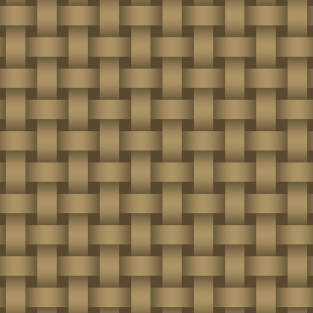 | Canvas/burlap | HIT |
| 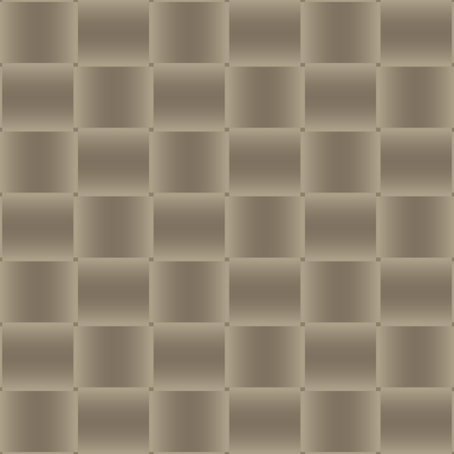 | Wool/chunky knit | Partial (basket-weave, not true loops) |
| 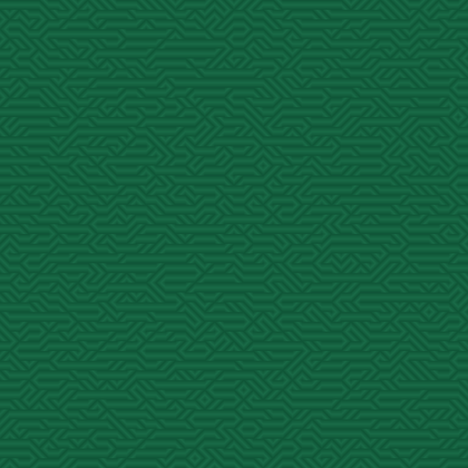 | Silk/satin | HIT |
|  | Velvet | HIT |

- **Canvas/burlap (HIT):** retype the generator to `weave` (plain over/under,
  one output) at a coarse scale (`columns`/`rows` ~10) with `width` ~0.6 so
  gaps show between thick threads. Natural tan, high roughness, `param4=0`
  normal fix at moderate strength for pronounced coarse-thread relief.
- **Wool/chunky knit (PARTIAL — be honest about this one):** tried `weave2`'s
  `stitch` param first, expecting loop softness — it just renders a crisp
  herringbone/basket diagonal, structurally the same hard-crossing weave as
  `weave`. **This catalog has no true loop-knit generator.** The workable
  stand-in: `weave` at a COARSE scale with near-max `width` (few, wide,
  almost-touching ribs) reads as chunky blocky yarn rows, not fine thread —
  closer to a basket/chunky-weave textile than true knit loops, but a
  reasonable substitute. Don't oversell it as "knit" in user-facing copy.
- **Silk/satin (HIT):** retype to `diagonal_weave` at a FINE scale (~48, vs
  denim's ~20) so the weave is nearly invisible — the differentiator from
  denim/canvas isn't visible thread texture, it's LOW roughness (glossy) +
  saturated low-contrast jewel-tone albedo. Normal strength very low
  (~0.08) — just enough faint sheen-line variation to read as woven, not
  flat plastic.
- **Velvet (HIT, but took two tries):** a soft fibrous pile has NO grid
  pattern, so this isn't a weave graft at all.
  - First attempt reused the granite speckle lever (voronoi **port 2** =
    `rand3`, flat per-cell random) at voronoi's max scale (32). Looked
    mottled/faceted like crystal or stone, not soft fabric — voronoi cells
    are still ~60px wide on a 2048px render, and a flat per-cell random
    value creates hard, high-contrast patch edges no matter how narrow the
    color gradient is (the per-cell value still spans the full gradient
    range).
  - Tried grafting a `fast_blur_shader` node between the voronoi and the
    colorize feeds to soften those edges — hit a Godot "invalid shader"
    render failure (its input port is `rgba`; voronoi port 2 is `rgb`).
    Not worth chasing for a one-off; noted here so nobody re-tries it blind.
  - **What actually worked:** retype the generator to `perlin` instead of
    voronoi. Perlin is continuous (no cell edges) and `iterations` (octaves,
    up to 10) layers in fine high-frequency detail on top of the base noise
    — genuinely reads as soft fiber grain. Deep saturated wine albedo, high
    roughness, and a very low `normal_map` `param1` (~0.12, still `param4=0`
    since perlin is a directly-fed analytic generator) for soft nap relief
    instead of hard relief.
  - **General lesson:** for a SOFT/continuous material (velvet, felt, fog,
    skin), reach for `perlin`/`fbm` first, not `voronoi` — voronoi's cell
    boundaries are inherently hard-edged even when blurred at the color
    level; perlin has no edges to begin with.

## Organics cookbook (cookbook growth, informal — 2026-08-26)

Same informal convention, widening organism SURFACES beyond the frozen set's
GROUND organics (`o01` moss, `o02` dry mud). Builders:
`quality/cookbook_organics.py`. All 4 were HITs on the first pass, no
iteration needed — every one reused an already-proven lever.

| Preview | Material | Verdict |
|---|---|---|
| 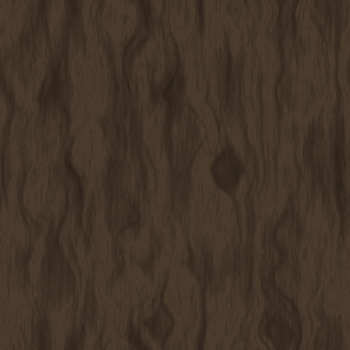 | Tree bark | HIT |
| 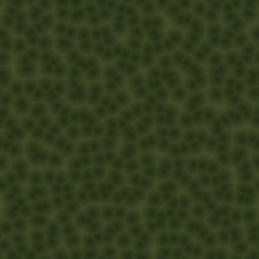 | Snake scales | HIT |
| 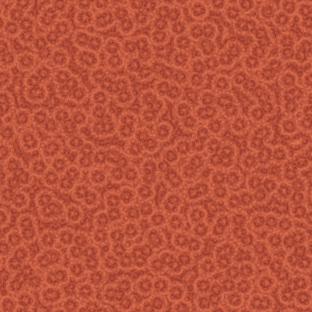 | Coral | HIT |
| 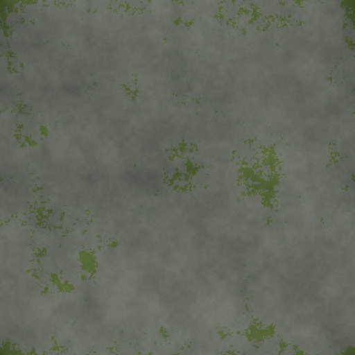 | Lichen-crusted rock | HIT |

- **Tree bark:** clone `wood` UNMODIFIED structurally — unlike `m02` aluminum
  (which straightens the grain to kill wood's knots), bark WANTS the knotty
  waviness, so leave `wood`'s knot-overlay chain alone. Just the recolor
  lever (weathered gray-brown, multi-stop for tonal variation) + push
  roughness high. `wood`'s own normal chain already works unmodified (`w01`/
  `w02` are proof), so no `param4` fix needed.
- **Snake scales:** `crocodile_skin`'s own default voronoi cellular pattern
  IS already a reptile-scale layout — that's what it was built to look like.
  No retype, pure recolor lever (olive-to-khaki, lower roughness than
  leather for a scale sheen). Proactively applied the `param4=0` fix even
  though `f02` leather's HIT never depended on it: `crocodile_skin`'s normal
  chain (`voronoi_0 -> colorize_0 -> normal_map_0`) is directly-fed with no
  buffer, the same shape as the denim blocker, so it renders flat by
  default. The faceted per-cell relief this produces is a better tell for
  "scales" than the albedo, which stays fairly soft/blurred by the donor's
  own design (same as leather's albedo) — for THIS material, that's fine:
  the read comes through the normal.
- **Coral:** retype the generator to `fbm` with `noise=2` (Cellular) instead
  of `voronoi` — same "distinct cells" family, but fbm's cellular noise
  gives a porous, irregularly-pitted surface rather than voronoi's flat-
  faceted cells, a better match for coral's texture. Coral pink/orange,
  matte, pronounced `param4=0` relief for the pitted bumps.
  General note: `fbm`'s `noise` enum (Value/Perlin/Cellular×6) is a whole
  family of generator shapes worth remembering as an alternative to
  `voronoi` for cell-like patterns.
- **Lichen-crusted rock:** clone `rusted_metal`'s two-layer masked-blend
  structure (the same one `m01` weathered copper already proved) but
  recolor to stone+lichen instead of metal+patina — base (`colorize_2`) to
  gray stone, patch (`colorize_1`) to lichen green-gray, widen the mask
  (`colorize_3` threshold) for more coverage. One real gotcha:
  `rusted_metal` wires the Material's metallic input straight off the mask
  (`colorize_3`) — correct for a metal donor, wrong once recolored to
  stone, so `drop_conn` that connection and force the Material's own
  `metallic` scalar to 0. Also grafted a light `normal_map` fed from the
  mask (`rusted_metal` ships with no normal chain at all) so lichen patches
  read as faintly raised rather than a pure flat-color swap — a nice-to-have
  the donor's own verified `m01`/`m03` cases don't bother with.

## Sci-fi panels cookbook (cookbook growth, informal, 2026-08-26)

A category with no frozen-set precedent at all -- nearest bundled examples
(`metal_pattern_2`/`3`) are undocumented anywhere else in this project.
Builders: `quality/cookbook_scifi.py`. Introduces the **`pattern`** node
family (independent x/y wave generators -- Sine/Triangle/Square/Sawtooth/
Constant/Bounce -- combined via a mix mode) as a new lever alongside weave/
voronoi/perlin/fbm. 3/4 HIT; the 4th is an honest partial with an unresolved
bug, documented rather than papered over.

**Not worth wiring:** Material's `emission_tex` port (port 3). The render
pipeline's export target ("Godot/Godot 4 Standard") only produces albedo/
normal/heightmap/orm -- an emission-only "glowing panel" material would be
invisible in the actual 4-map product output. Ruled out a glowing-tech-panel
idea for this reason before building anything; swapped in the vent grille
instead.

| Preview | Material | Verdict |
|---|---|---|
| 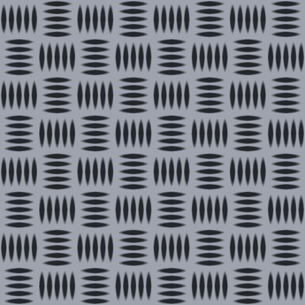 | Diamond-plate hull panel | HIT |
| 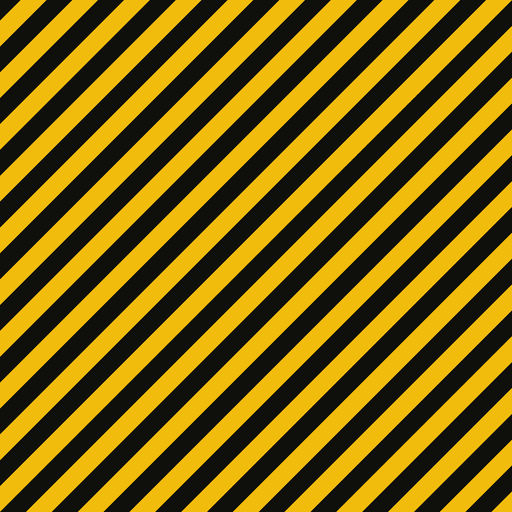 | Hazard stripe panel | HIT |
| 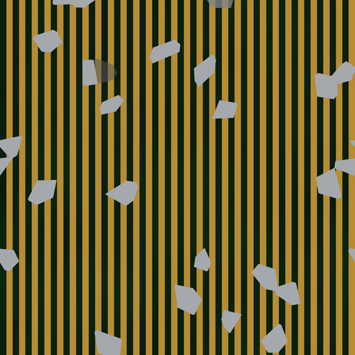 | Circuit board | HIT (bleed-through root-caused + fixed 2026-09-01) |
| 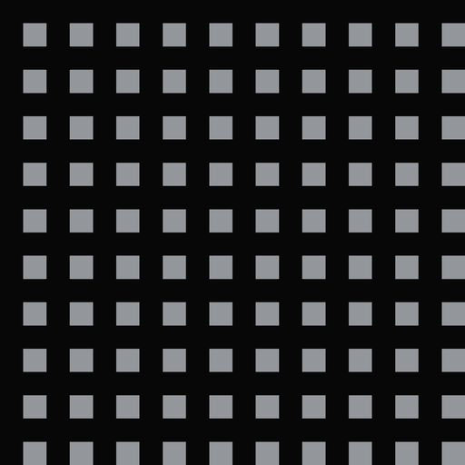 | Vent grille panel | HIT |

- **Hull plating:** clone `metal_pattern_2` (a bundled example with a
  working grid-line normal chain, but NO albedo texture at all -- it relies
  entirely on Material's flat scalar `albedo_color`). Graft the SAME grid
  pattern (`blend_0`'s output) into new `colorize` nodes feeding both
  albedo AND roughness, so panel seams read as visibly darker/duller, not
  just normal-lit. Proactive `param4=0` -- `blend_0`'s inputs are pattern
  generators (analytic), the same directly-fed shape as every other
  flat-normal blocker.
- **Hazard stripe panel:** built fresh (no donor has diagonal stripes).
  `pattern` node with `x_wave=Square` for alternating bars, `y_wave=
  Constant` so bars run along Y before rotation. Wiring order matters:
  `pattern`(f) -> `colorize`(converts to rgba, hard yellow/black threshold)
  -> `transform`(rotate 45). Feeding `transform` directly from `pattern`'s
  'f' output is a port-type mismatch (`transform`'s input is `rgba`) --
  matches `metal_pattern_2`'s own wiring order, which was the tell.
- **Vent grille panel:** ONE `pattern` node with BOTH `x_wave` and `y_wave`
  set to Square and `mix=Min` gives a grid of small square holes in a
  single node (Min of two square waves = their intersection). Distinct
  from `man01`'s hexagonal grating (beehive-based) -- a square punch
  pattern instead.
- **Circuit board (HIT — the bleed-through bug is root-caused and fixed,
  2026-09-01):** dark PCB base + fine bright traces + scattered "chip" blocks.
  - v1 used a SECOND `pattern` node with `mix=Xor` of two Square waves for
    the chip mask -- rendered as pure stripes, chip layer completely
    invisible at every threshold tried. `pattern`'s Xor mix mode isn't
    documented beyond the enum name; not worth reverse-engineering.
  - v2 swapped to the PROVEN granite-speckle lever (voronoi port 2, flat
    per-cell random). Chips appeared, but at scale 6 they were huge camo
    blobs; v3 raised voronoi scale to 18 for small, sparse, chip-sized blocks.
  - **The bleed-through bug, RESOLVED.** For several sessions the trace stripes
    faintly bled through the chip shapes even with `blend_type=0` "Normal" at
    `amount=1`. The root cause was a **type confusion, not a mask-threshold
    problem** (an earlier session had ruled out the razor-thin-threshold
    hypothesis). `blend`'s opacity is `amount * a($uv)` (see
    `addons/material_maker/nodes/blend.mmg`), where `a` is the **port-2**
    input. The recipe fed the chips' ALBEDO colorize (whose "on" value is gray
    **0.65**) as that opacity input, so chips rendered at `1 × 0.65 = 65%`
    opacity and ~35% of the trace layer bled through. Confirmed three ways: the
    wiring, the shader source, and the render matching the predicted 65%.
    **Fix: split the mask off from the albedo** — a separate hard-`1.0` mask
    colorize on the SAME voronoi threshold drives opacity; the albedo colorize
    still drives colour. This is exactly the pattern `cookbook_stone`'s s04
    already used (a dedicated `colorize_gap` 0/1 mask), which this recipe had
    violated. The traces had the identical latent issue (their gold colorize,
    luminance ~0.57, doubled as their own mask, so the base bled ~43% through
    them and they read muted olive); the same split-mask fix makes them solid
    bright gold.
  - **General lesson (the durable one):** in Material Maker a `blend`'s opacity
    is `amount × port-2 mask`. If you feed a mid-value COLOUR into port 2, the
    layer is partly transparent no matter what `amount` is. Port 2 wants a hard
    **0/1** mask; never reuse the layer's albedo colorize as its own opacity
    unless that colorize's "on" value is genuinely 1.0. Also: for a FLAT
    per-cell mask (voronoi port 2), use a near-hard threshold step — a wide
    colorize ramp doesn't anti-alias edges there (the input is constant across
    a cell), it just leaves borderline-value cells as faint partial ghosts; the
    ramp only buys AA when the mask input is continuous (like a `pattern` wave
    at a stripe edge).

## Terrain cookbook (cookbook growth, informal, 2026-08-26)

Ground/landscape materials beyond `o01` moss / `o02` mud (organic-growth
focused). Builders: `quality/cookbook_terrain.py`. 4/4 HIT, one after a
one-shot empirical fix.

| Preview | Material | Verdict |
|---|---|---|
| 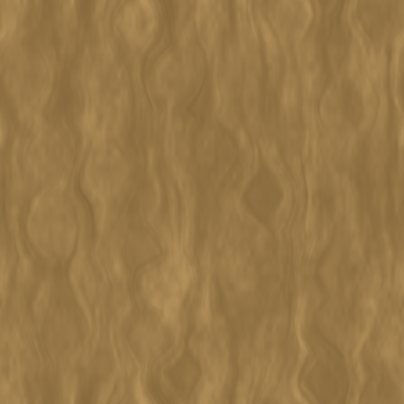 | Sand dunes | HIT |
|  | Fresh snow | HIT |
| 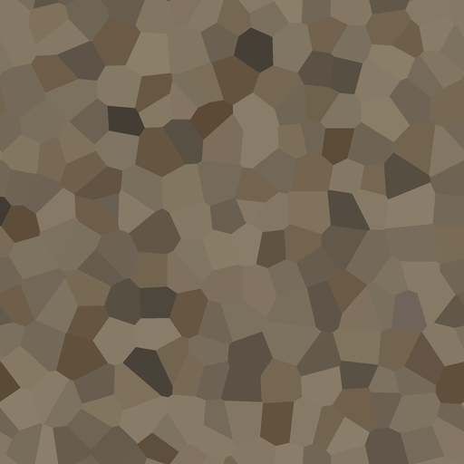 | Gravel | HIT |
| 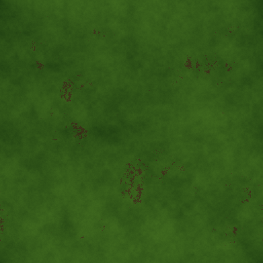 | Grass field | HIT (after 1 fix) |

- **Sand dunes:** clone `wood` UNMODIFIED structurally (like `o03` bark) --
  dune ripples are organic and wavy, so KEEP the knot-warp chain rather
  than straightening it like `m02` aluminum. Widened `perlin_2`'s scale for
  broad, slow-rolling ripples instead of tight wood grain. Warm sand tan,
  high roughness, no normal fix needed (`wood`'s own chain already works
  unmodified).
- **Fresh snow:** clone `rock` and KEEP its smooth blobby structure -- per
  AUTHORING.md's own rule, a smooth source is fine when the target is
  genuinely near-flat, and snow drifts are exactly that case (same
  reasoning `s02` granite used for reusing `rock`). Near-white albedo with
  a faint cold blue-gray in the low points, forced near-zero metallic
  (`perlin_0` feeds it directly by default in this donor, wrong for snow).
  Proactive `param4=0` at LOW strength (~0.18) -- soft drifts, not
  stone-scale relief.
- **Gravel:** clone `rock`, reuse `s02` granite's v2 lever (voronoi port 2,
  flat per-cell random, bypassing the smooth blend) but at PEBBLE scale
  (14, vs granite's fine-fleck 44) and a wider earthy gray/tan/brown
  palette instead of granite's grayscale. Stronger `param4=0` relief than
  granite -- loose gravel is bumpier than a polished slab.
- **Grass field (one real fix needed):** clone `rusted_metal`'s two-layer
  masked-blend structure (the same template `o06` lichen-on-rock proved
  twice) and recolor to soil+grass. Unlike lichen (sparse patches on a
  dominant base), grass should be the DOMINANT layer with dirt only
  showing through in patches.
  - v1 moved the mask threshold DOWN (0.22), reasoning by analogy with how
    `o06`/`m01` "widen" their patch layer by lowering the threshold --
    rendered almost the opposite of intended: near-total soil with only
    tiny green flecks. Checked the normal map too: nearly flat, confirming
    the mask was saturated one way across ~all of the image, not a gradual
    shift.
  - Reasoning abstractly about `blend_type`'s exact mix formula and
    `colorize`'s duplicate-point step extrapolation didn't resolve which
    direction was correct for this specific base/patch/threshold
    combination -- rather than debug the formula, just flipped the
    threshold UP instead (0.65) and re-rendered.
  - That flip alone produced the intended dominant-grass-with-dirt-patches
    look on the first try. **Lesson: don't trust mask-threshold direction
    by analogy across different cases -- render and look, the direction
    isn't reliably predictable from another recipe's stated behavior.**

## Wood cookbook (cookbook growth, informal — 2026-08-28)

`quality/cookbook_wood.py`. `w01_oak_planks`/`w02_weathered_barn_wood` are
already frozen in the Phase 3 test set — these three extend the category
further, reusing the recolor and masked-composite levers rather than
inventing new mechanics. `wood`'s own generator chain already renders real
grain relief out of the box (verified by the two frozen cases), so none of
these touch `normal_map`'s `param4` switch.

| Preview | Material | Verdict |
|---|---|---|
| 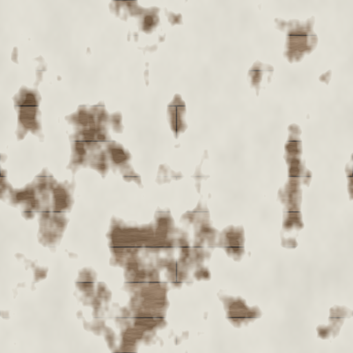 | Painted plank siding, worn | HIT (after a donor swap) |
| 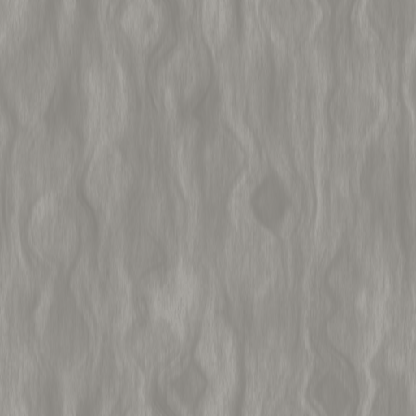 | Bleached driftwood | HIT |
| 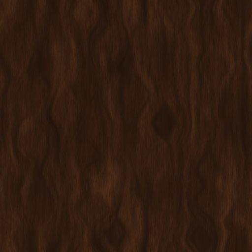 | Dark walnut, semi-gloss | HIT |

- **Driftwood / dark walnut (HIT, first try):** pure recolor of `wood`'s
  existing `colorize_2` (albedo) / `colorize_0` (roughness) ramps, the exact
  lever `w02` barn wood already uses. Driftwood: pale, low-saturation gray.
  Walnut: deep saturated brown, lower roughness for a sealed/finished look
  vs. barn wood's raw weathered surface.
- **Painted plank siding (HIT after a donor swap — the key lesson here):**
  the masked paint-over-wood composite is the same lever as
  `combo01_rusted_painted_steel`, but the DONOR choice is what actually made
  or broke this one. Three passes cloned `wood` (pure vertical grain, no
  board structure) and read as abstract cow-hide / paint-splatter blobs no
  matter how the mask was tuned — **because nothing in `wood` says
  "boards," so nothing said "siding."** (Along the way, a razor-thin mask
  threshold + a stark white-paint-vs-dark-grain palette also produced
  visible `blend`-edge speckle Grayson flagged as "alpha problems"; that was
  a real, separate `blend`-opacity artifact, see the s05 note below —
  widening the threshold band fixed the speckle but NOT the
  doesn't-read-as-siding problem.) **The fix was the donor:** clone
  `wooden_floor` instead (its `bricks_0` at 10 rows / 1 column gives
  horizontal planks with seam lines, and its `blend_0` already carries plank
  albedo + relief), then composite the paint over `blend_0`. On a planked
  base it reads as painted siding immediately.
  **Lesson: match the donor's underlying STRUCTURE to what the material
  fundamentally is (planks, cells, grain, weave) before tuning color/mask —
  no amount of surface tuning adds structure a donor doesn't have.** Also,
  the speckle fix (widen the band) did NOT generalize to `sf03`'s unrelated
  trace-bleed-through bug — treat each `blend` artifact on its own.
  **Two more rounds after the donor swap, both from Grayson's direct
  review** ("the white feels weird"): (1) the paint gradient topped out at
  only 0.88 brightness with a warm yellow-brown cast — it read as a dirty
  stain, not paint. Brightened to 0.84–0.94 and neutralized the cast.
  (2) the wide 0.20–0.50 mask band (needed to kill the earlier speckle) also
  made wood the MAJORITY and paint the minority — backwards for siding that
  should read as mostly painted with worn patches. Fixed by moving the band
  to 0.55–0.72 (same width, shifted position) so wood is the sparse minority
  showing through, not the dominant surface — band position controls
  majority/minority balance independent of the width that controls edge
  softness, so this didn't reintroduce the speckle.

## Stone/masonry cookbook (cookbook growth, informal — 2026-08-28)

`quality/cookbook_stone.py`. `s01_red_brick_wall`/`s02_gray_granite`/
`s03_cracked_concrete` are already frozen in the Phase 3 test set — these
three extend the category, at Grayson's specific request for something
"natural and organic" and deliberately less patterned than the frozen set's
brick coursing or crack network.

| Preview | Material | Verdict |
|---|---|---|
| 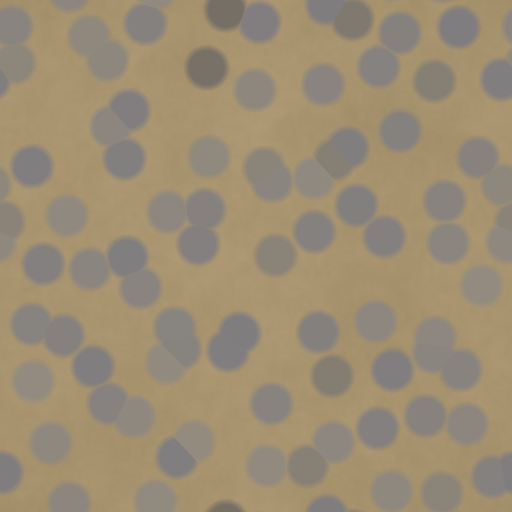 | Scattered river stones in sand | HIT (after fixing an inverted mask) |
| 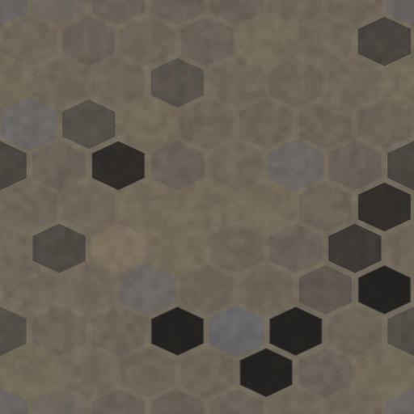 | Hex stone tile / mosaic | Partial (not true cobblestone) |
| 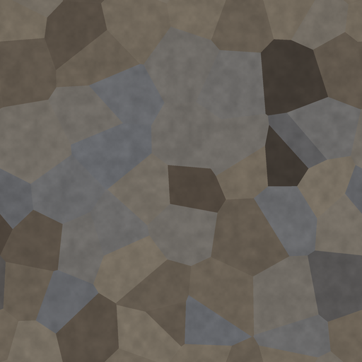 | Natural river pebbles | HIT (judge in 3D, not the albedo) |
| 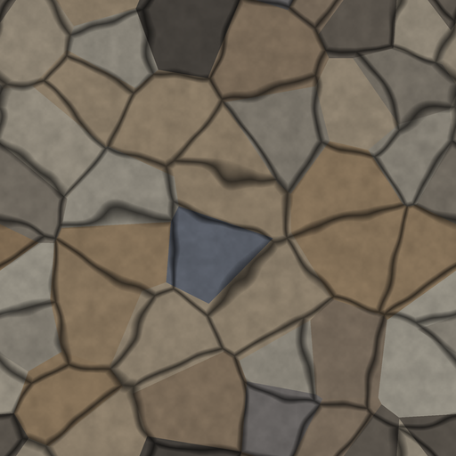 | True irregular cobblestone | HIT (closes the s05 "true cobblestone" gap) |
| 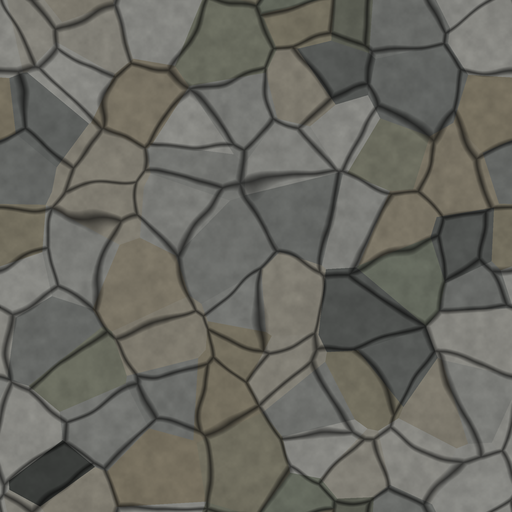 | Dry-stone / fieldstone wall | HIT (random packing, no coursing) |
| 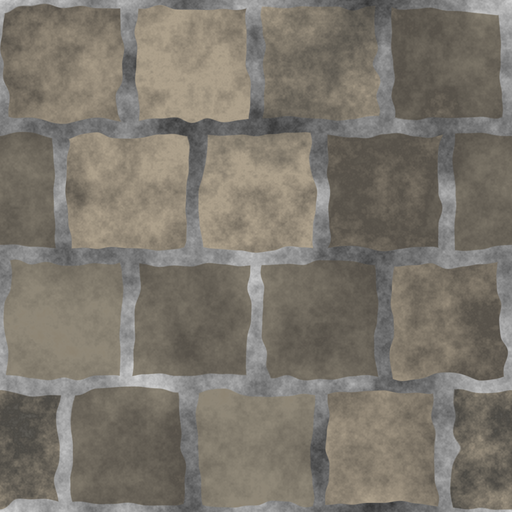 | Ashlar / castle block wall | HIT (coursed cut blocks) |
| 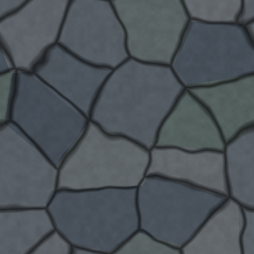 | Flagstone / slate paving | HIT (large flat slabs) |
| 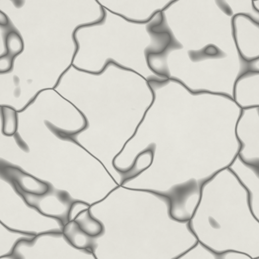 | Polished marble | HIT (gloss undersold by the dark preview scene) |

- **Scattered river stones in sand (HIT, after fixing a genuinely inverted
  mask):** originally this slot was a raw-poured-concrete recipe (CLONE
  `rock`, crush `voronoi_0` to scale 2 for soft unpatterned staining, low
  relief) — a clean HIT on Grayson's first "natural and organic" ask. He
  later asked to replace it with something "softer, like river stone, maybe
  even pebbles," distinct from `s06`'s tightly-packed mosaic. (If a poured
  concrete recipe is wanted again, the exact params are in this file's git
  history / the session log — the mechanism was proven, just swapped out
  here.)

  New approach: CLONE `rock` again, but instead of blending fields for a
  flat look (concrete) or filling the whole frame with cells (`s06`),
  THRESHOLD `voronoi_0`'s own distance field (port 0) directly into a
  stone-vs-sand mask, so stones sit in a connected sand matrix with visible
  gaps — the "softer, scattered" look, vs. `s06`'s edge-to-edge packing.
  **First attempt had the mask backwards:** assumed port 0 (F1, distance to
  the nearest voronoi seed) was HIGH at cell centers: it's actually LOW at
  centers and rises toward the inter-cell network. Thresholding on that
  wrong assumption painted tiny sand-colored DOTS at the cell centers with
  stone filling everywhere else — the exact inverse of "rounded stones in
  sand." **Fixed by flipping the gradient direction** (low F1 → mask 1 /
  stone, high F1 → mask 0 / sand) and widening the stone zone so each
  becomes a real rounded pebble, not a pinprick. Confirmed via
  `render_preview` (this is relief-driven, same rule as `s06` below) —
  rounded stone bumps genuinely sit in a sand bed under real lighting.
- **Hex stone tile (PARTIAL — be honest about this one):** reused beehive's
  hex relief chain (same lever as `man01`/`man02`), keeping the DEFAULT
  per-cell-random blend so each tile reads as a genuinely different natural
  stone tone, not a flat repeat. First attempt at the default hex scale
  (`sx`20/`sy`12) plus a wide dark-mortar band rendered as a busy dark
  digital-camo grid, not stone — fixed by shrinking to `sx`7/`sy`5 (big
  cobbles, not a fine grid) and narrowing the dark band to a thin edge
  (0.0–0.08, matching `man01`'s actual ratio) so stone dominates coverage.
  **This produces a good-looking natural-toned stone mosaic, but beehive's
  hex grid is perfectly regular.** Real cobblestone/crazy-paving has
  irregular, variously-sized stones, which this doesn't have — don't oversell
  it as "cobblestone" in user-facing copy. A voronoi-plate approach (like
  `dry_earth`'s cracked-plate network, recolored to stone tones with
  per-plate variation) would likely get genuine irregularity; untried here,
  open item for whoever wants true cobblestone next.
  **Detail pass:** Grayson judged the first version too flat, wanted
  "another level of detail." Each hex face was one uniform color; added a
  fine perlin (`scale` 48, `iterations` 5) multiplied over both albedo and
  roughness through a new `blend_type=2` (Multiply) node with NO mask
  connected — the "a"/opacity port's own unconnected default is a uniform
  1.0, so there's no threshold and none of `w03`'s mask-edge speckle risk
  applies. **Caveat that cost real time to notice:** the tracked 512px
  preview thumbnail (`_make_previews.py`'s downscale) hid this fine grain
  almost completely — it only became visible cropping the real 2048px
  render. Any future "does this look detailed enough" judgment on a fine
  high-frequency effect should check the full-res render under
  `quality/cookbook/<label>/<case>/`, not just the docs preview.
- **Natural river pebbles (HIT — but you MUST judge this one in 3D):**
  the organic counterpart to s05's regular hex tile. CLONE `rock` (same
  donor as `s02` granite), but tune for BIG rounded cells instead of
  granite's fine flecks: drop both voronoi scales to ~7 (pebble-sized
  cells), feed albedo from `voronoi_0` PORT 2 (per-cell random) through a
  multi-tone natural-stone gradient so each pebble is a different tone, and
  raise the normal strength (`param1` ~0.6, `param4=0`) so each cell bulges
  into a rounded stone. Plus the same fine-perlin-grain multiply as s05 for
  per-stone surface texture. **The albedo map alone looks like flat angular
  polygons — the rounding lives entirely in the NORMAL map, so the flat
  swatch badly undersells it.** Confirmed correct only by running
  `render_preview` (the sphere/cube/ground 3D composite): under real
  lighting the cells read as tightly-packed rounded natural stones. Rule
  this reinforces: for any relief-driven material (pebbles, cobbles, plating,
  anything where the shape is in the normal not the albedo), judge it with
  `render_preview`, not the albedo thumbnail. It's closer to a packed
  gravel/fieldstone bed than perfectly smooth individual river stones (the
  cells are still voronoi-angular), but reads clearly as natural stone.

### Masonry expansion (2026-09-01): cobblestone, fieldstone, ashlar, flagstone, marble

Five more, added in one pass. s07/s08/s10/s11 all CLONE `dry_earth` (its
`voronoi_0` port-1 crack network warped by `perlin_1` into `blend_0`); s09
clones `stone_wall` (a `Bricks`-node donor) instead. The single biggest lever
across the dry_earth four is `warp_0.amount`, and it cuts both ways: on paving
it is haze to suppress, on marble it is the whole effect.

- **True irregular cobblestone (HIT — closes the s05 gap):** the voronoi-plate
  approach s05's docstring flagged as untried. CLONE `dry_earth`, `voronoi_0`
  scale 4→6 (cobble-sized plates), feed **`voronoi_0` port 2** (per-cell random)
  through a multi-tone stone gradient and REWIRE it into `blend_0` port 1 in
  place of the flat perlin earth base — each plate now a distinct stone, and the
  existing warped-crack Multiply overlay reads as recessed mortar. **Two traps,
  both cost a pass:** (1) the first tone gradient was too narrow (0.30–0.55
  muted) so plates looked uniform — widen it hard across value AND hue. (2) the
  broad gray HAZE inside plates was NOT the gradient: it is `dry_earth`'s stock
  `warp_0.amount` of 0.4 smearing the crack shadows into washes across the
  plates. **Diagnostic that split the two:** re-render once with a maximally
  high-contrast test gradient on the per-cell colorize — if each plate goes a
  distinct flat colour and the haze remains, the haze is the warp, not the
  ramp. Fix: drop `warp_0.amount` to **0.12** (clean thin mortar, slight organic
  wobble). Judge in 3D (`render_preview`) — the cobbles bulge, the mortar
  recesses.
- **Dry-stone / fieldstone wall (HIT):** same `dry_earth` clone, retuned to read
  as a different material, not a recolor. `voronoi_0` scale 6→8 (smaller, denser
  stones), cool weathered-GRAY palette (vs cobblestone's warm tan), thin dark
  dry-stack gaps. **`warp_0.amount` stays at the haze-free 0.12** — a pass at
  0.20 chasing more angular edges just brought the haze back WITHOUT sharpening
  corners (warp displaces, it does not bevel; voronoi cells are already
  polygonal, so the angular fieldstone read comes from the cell shape). Keep the
  mossy-green stop restrained: pushed further it tips into a camo grid (the same
  trap s05 hit). Honest limit: pure voronoi has no horizontal coursing, so this
  is random rubble/fieldstone, not neatly coursed drystone.
- **Ashlar / castle block wall (HIT):** the REGULAR, quarried counterpart to
  s08's random fieldstone — and the one material that leaves the voronoi cluster,
  because a `Bricks` node gives true coursed rectangular blocks that voronoi
  never can. CLONE `stone_wall` (already a Bricks-driven stone wall).
  **`Bricks` port 1 is the per-brick random — the brick analogue of voronoi port
  2** — and stone_wall already routes it into the per-block tone colorize
  (`colorize_1`). Retune: `Bricks` columns/rows 3×6 → 4×4 (squarer, larger
  ashlar blocks), keep `row_offset` 0.5 (coursed/broken joints) and the 0.15
  bevel (chamfered cut-stone edge), fine mortar 0.06; recolor the per-block ramp
  to dressed limestone/sandstone and temper stone_wall's rustic orange block.
  The pale lime joints deliberately contrast s08's dark gaps in the set.
- **Flagstone / slate paving (HIT):** `dry_earth` clone tuned the OPPOSITE of
  cobblestone on every axis. `voronoi_0` scale 4 (few big slabs), **`normal_map`
  `param1` 0.99 → 0.5 for FLAT slab tops** (cobbles bulge; sawn flagstones are
  flat, relief lives only in the recessed joints), `warp_0` at the haze-free
  0.12, and a cool blue-gray / green-gray slate palette with LOW per-slab
  variation (slate slabs are fairly uniform, so a subtle tonal shift, not the
  strong hue spread cobbles want).
- **Polished marble (HIT — but the preview scene undersells the gloss):** the
  one non-paving recipe. Same `dry_earth` donor used for its VEIN STRUCTURE, not
  its plates. Every lever inverts the paving recipes: `voronoi_0` scale 3 (few
  large sweeping veins), **`warp_0.amount` 0.12 → 0.5 (HIGH)** — on paving this
  smear was haze to kill; on marble the flow IS the look, soft cloudy veins
  wandering across the slab. **NO per-cell tone** (marble is one uniform stone,
  not a mosaic): base is a near-white cream on `colorize_0`, veins a soft gray
  from the crack Multiply eased to 0.5. Polish setup: metallic zeroed by setting
  `colorize_3` (→ Material metallic) to all black, and roughness dropped to 0.15
  on the **Material node's own `roughness` param** (its port 2 is unconnected, so
  the param applies); `normal_map` `param1` → 0.1 (veins a whisper of relief, not
  joints). Caveat: the material IS glossy, but `render_preview`'s dark backdrop
  gives a low-roughness dielectric nothing to reflect, so it reads honed/matte in
  the preview — the same reason pure metals render dark there. Scope: soft
  Carrara veining, not the angular fragments of breccia marble (which the
  UN-warped voronoi cells would actually suit).

**Tooling note (2026-09-01):** render these via `quality/render_one.py <label>
<case>` (a single-case renderer added this session) or `render_cookbook.py`, run
as a script FILE. Do NOT drive a Godot render from `python -c "..."`: launching
the console binary that way leaves the launcher process not exiting, which reads
as a bogus 180s render timeout (it is a console/handle quirk of the `-c`
invocation, not a pipeline bug). A real latent `render.py` hang was also fixed
this session (temp-file redirect replacing a `communicate()` pipe-EOF block); see
the session log.

## Leather cookbook (cookbook growth, informal — 2026-08-29)

`quality/cookbook_leather.py`. `f02_brown_leather` is already frozen in the
Phase 3 test set (a plain `crocodile_skin` recolor) — these six extend the
category into distinct finishes. All six clone `crocodile_skin`, the proven
leather donor: its cellular voronoi grain drives albedo (`colorize_1` →
Material.albedo), roughness (`colorize_3` → Material.roughness) and a height
chain (`voronoi_0` → `colorize_0` → `normal_map_0` → Material.normal).

| Preview | Material | Verdict |
|---|---|---|
|  | Black oiled/waxed leather | HIT (judge in 3D — dark albedo undersells it) |
| 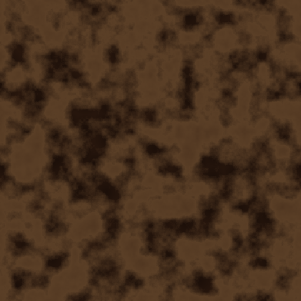 | Distressed two-tone worn leather | HIT (after reworking the wear mask) |
| 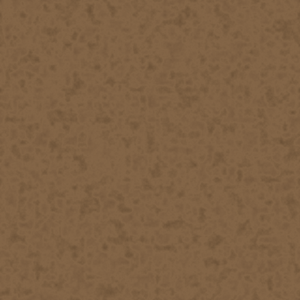 | Suede / nubuck | HIT |
| 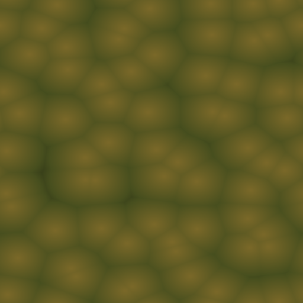 | Exotic reptile scale | HIT (after fixing the albedo polarity) |
| 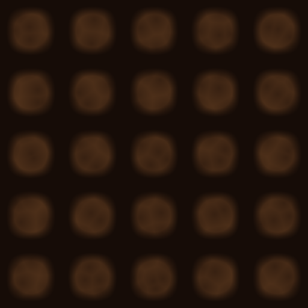 | Quilted / tufted leather | HIT (quilt + channel seams; no per-stitch dashes) |
| 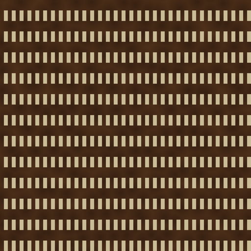 | Topstitched leather (raised stitch dashes) | HIT (bold rather than fine; judge in 3D) |

- **The inverted-grain trap (applies to EVERY cell-based leather here):**
  `crocodile_skin`'s stock height ramp (`colorize_0`, fed by `voronoi_0`
  port 0) maps low→dark, high→bright. Voronoi port 0 is LOW at cell centers
  and HIGH at the borders, so the stock ramp raises the SEAMS and sinks the
  scale bodies — grain that looks inside-out (edges higher than the middle,
  caught in the 3D preview). Physically, pebbled/scaled leather wants the
  scale bodies domed UP and the seams recessed. **Fix: reverse the
  `colorize_0` ramp** (centers→high, borders→low) — the `_dome_the_cells`
  helper in `cookbook_leather.py`. This is the exact same port-0 polarity
  confusion the stone cookbook hit with its scattered-river-stones mask;
  worth internalizing: **voronoi port 0 is low at centers, high toward the
  network.** (Suede is exempt — it's a perlin donor with no cells.)
- **Black oiled/waxed leather (HIT — judge in 3D):** pure recolor to a
  near-black warm base with a lifted brown highlight in the raised grain,
  plus LOW roughness for a conditioned/polished finish and the `param4=0`
  grain-relief fix. The albedo thumbnail is nearly black and shows almost
  nothing; the pebble grain and its specular only read under real lighting,
  same rule as the stone pebbles. First pass was too dark even in 3D —
  lifting the highlight stop (grain ~0.22/0.16/0.11) made the grain read.
- **Distressed two-tone worn leather (HIT — after reworking the wear
  mask):** the masked-composite lever (same as `combo01`/`w03`), but here
  BOTH layers are leather — a dark saddle base with a lighter rubbed tan
  showing through irregular worn patches, for albedo and a small roughness
  lift. **The wear mask is the whole game, and it's easy to get wrong:** the
  first pass used a coarse perlin (`scale` 7) with a narrow threshold band
  and a big base-vs-worn tonal gap → a few giant high-contrast blotches that
  read as cow-hide/Holstein spots, not wear (the exact trap `w03` documents).
  Fixed with a FINER perlin (`scale` 16, `iterations` 6), a WIDE feathered
  threshold band (0.40→0.72), and a SMALL tonal gap between base and worn, so
  the rubs read as a distributed change of finish, not a second color.
- **Suede / nubuck (HIT):** the donor-swap lever (same as `f06` velvet) —
  soft napped leather has no cellular grain, so retype `voronoi_0` to
  `perlin` (continuous, no hard cell edges; `iterations` add fine fiber
  grain), warm fawn albedo, very high matte roughness, and a very low
  `normal_map` `param1` (~0.10, still `param4=0`) so it's soft nap, not hard
  relief. Reads dead-on; no rework needed.
- **Exotic reptile scale (HIT — after fixing the albedo polarity):** the
  recolor lever leaning INTO the voronoi cell scale (`f02` kept the default
  fine grain) — drop `voronoi_0` scale to ~7×9 (fewer, bigger, slightly
  elongated scales), recolor to an exotic bronze-olive, and use STRONG
  `param4=0` relief (`param1` ~0.7) so the scale edges cast real depth.
  **The albedo ramp hit the SAME port-0 polarity trap as the height ramp,
  and it matters here because the colour contrast is high (unlike the
  near-monochrome f02/l01).** `colorize_1` is fed by `voronoi_0` port 0,
  which is LOW at the cell centers (the scale BODIES) and high at the borders.
  The first pass mapped low→dark, high→bronze, so the scale bodies came out
  dark and only the thin border seams got colour — the whole thing read olive
  with no bronze. Fix: reverse the ramp too (centers→bronze-olive body,
  borders→dark seam), so the scales carry the colour and the seams read as
  dark grooves. Same lesson as `_dome_the_cells`, applied to the albedo ramp.
  Also dropped the roughness from semi-gloss to a drier matte (was reading
  wet/plastic). Remaining knob a human can dial: the bronze still skews olive
  because the voronoi field rarely reaches the ramp's very top stop.
- **Quilted / tufted leather (HIT — reliable path found after a dead end):**
  a saddle-tan grain base raised into a grid of puffy pads with recessed
  stitch-channel seams (car-seat / chesterfield). **The stitch mechanism is
  the lesson here, and the obvious tool is a trap:** the natural way to lay
  down stitch dashes is a small `shape` repeated by `tiler`, but that FOUGHT
  BACK — in the full graph it produced no visible dashes, and isolating the
  tiler output to the albedo TIMED OUT the renderer at 180s (a single centered
  shape through `tiler` builds a degenerate/expensive shader in this setup).
  **The reliable path is the parameter-only `pattern` node** (same node the
  sci-fi cookbook uses): two Sine waves multiplied (`x_wave`/`y_wave` = Sine,
  `mix` = Multiply, scale ~5) give a smooth grid of rounded pads that peak at
  the pad centers and fall to the seams — the quilt shape, with no shape/tiler
  shader surprises. Drive the normal from the pattern pads (`param1` ~0.9 for
  pronounced padding) with the crocodile grain blended on top at ~0.35 for
  fine detail, and darken the seams in albedo (a seam mask off the same
  pattern) so the channels read as recessed. **Honest gap:** this delivers the
  quilt + channel seams but NOT individual per-stitch dash marks running along
  the seams — that needs a different dash generator (the `shape`+`tiler`
  trap above rules out the easy one). l06 solves the dash generator.
- **Topstitched leather — raised stitch dashes (HIT — two traps, one flip):**
  the real per-stitch marks l05 lacked: a grid of raised cream thread dashes
  in rows on saddle grain. Getting a dash generator that works took ruling out
  two approaches and correcting a polarity that bites twice:
  1. **`shape`+`tiler` is a trap** (also noted under l05): a single centered
     `shape` through `tiler` produced no visible dashes in the full graph and
     TIMED OUT the renderer at 180s when its output was isolated to albedo.
     Don't reach for it for a repeated-mark grid.
  2. **`pattern` Square×Square (Multiply) makes the grid reliably** — one node,
     `x_wave`/`y_wave` = Square, `mix` = Multiply, `x_scale`/`y_scale` set the
     dash pitch. But its **polarity is inside-out**: the pattern's HIGH (on)
     region is the connected FIELD, and the isolated rectangles you want as
     dashes are its LOW cells. Rendered straight, that put dark RECESSED marks
     on a flat thread-coloured field (the exact inverse of stitches). **Fix: a
     single reversed sharpen colorize** (`1` at the pattern's LOW, `0` at its
     HIGH) so the mask is 1 AT the dash marks — which corrects the colour AND
     un-flattens the field (the leather grain shows again) in one edit.
  With the mask right, the dashes drive a cream thread in albedo and a raised
  bump in the normal (blended over the grain height before `normal_map`,
  `param4=0`). Honest note: the dashes render bold/blocky rather than fine
  topstitch, and it's a full grid, not seam-following lines — finer dashes
  (higher `x`/`y_scale`) risk the docs thumbnail losing them, so judge in 3D.
  This is the same "isolating a node to albedo can time the renderer out"
  gotcha the diagnosis hit twice; when a mask needs checking, prefer reading
  the full render's channels over an isolate-to-albedo pass here.

## Painted-metal cookbook (cookbook growth, informal, 2026-09-01)

`quality/cookbook_painted_metal.py`. Ids are `pm01`-`pm05` (the frozen test
set already owns `m01`-`m03`, so the `m` prefix is off-limits). This whole
family is surface-finish, whose natural variation is roughness plus a faint
normal, which risks five gray panels differing only in gloss. Each material is
therefore built around a distinct STRUCTURAL read, not just a roughness value.

| Preview | Material | Verdict |
|---|---|---|
| 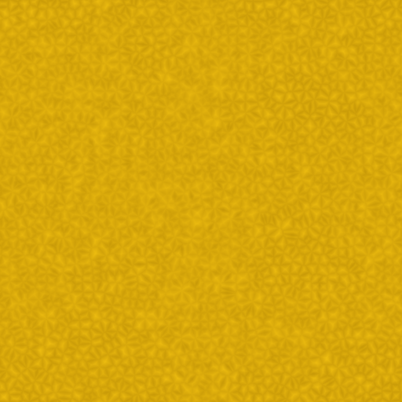 | Powder coat, safety yellow | HIT (fine orange-peel pebbling) |
| 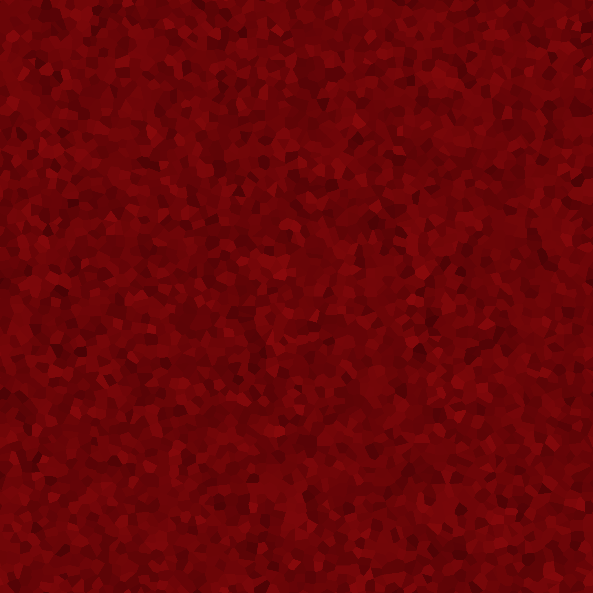 | Automotive enamel, deep red | HIT (near-mirror clearcoat + flake) |
| 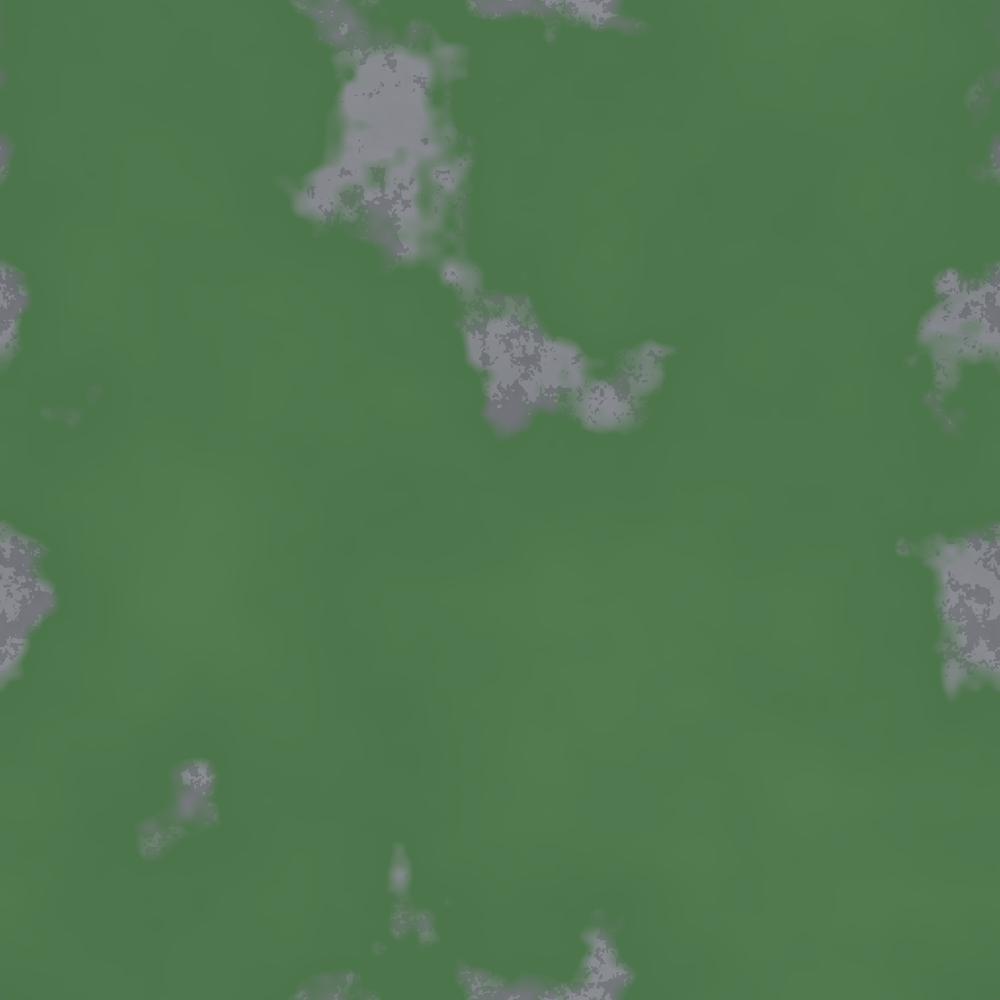 | Paint chipped to bare metal | HIT (masked metallic; not combo01's rust) |
| 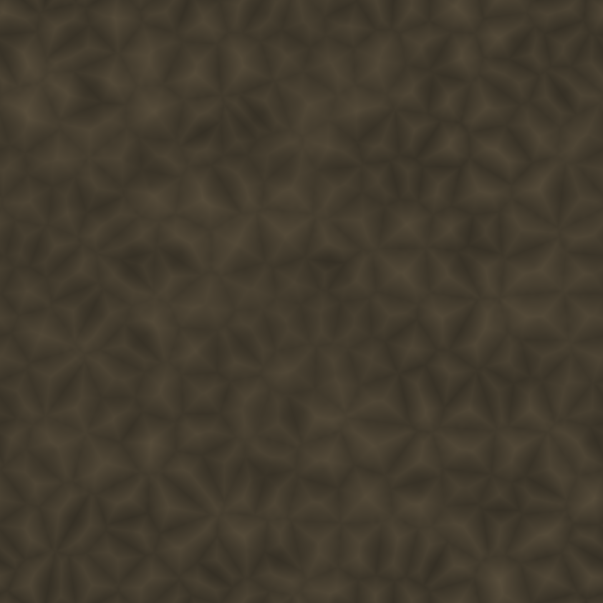 | Hammertone, bronze-gray | HIT (dimple field, strongest structure) |
| 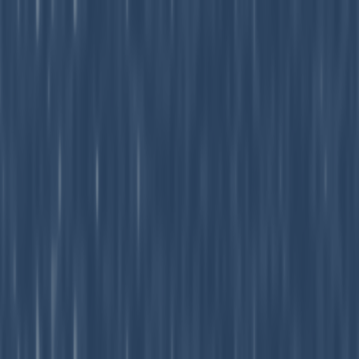 | Scuffed panel, utility blue | HIT (directional brushed scuffs) |

**Two PBR-correctness rules held throughout this family:**
1. **Metallic is a dielectric-vs-metal DECISION, never a global scalar.** Paint
   is a dielectric, so metallic = 0 wherever paint covers; only pm03's exposed
   bare metal is metallic 1, driven by the chip mask. A globally-metallic
   painted panel renders near-black in the preview scene.
2. **Every chip/wear mask fed to a `blend`'s port 2 is a HARD 0/1 step**, never
   a mid-value albedo colorize. A blend's opacity is `amount * port2`, so a
   mid-value mask makes the top layer semi-transparent (the sf03 bug). This bit
   pm03 during authoring (see its note).

- **Powder coat (HIT):** CLONE `rock` for its isotropic voronoi-warp-normal
  chain, but the first render read as a wormy crackle/foil, not orange peel.
  Root cause: `rock`'s `warp_0` (amount 0.3, coarse scale-4 perlin) smears the
  voronoi cells into ridges. **Fix: flatten the warp hard (`amount` 0.03) and
  push the cells fine (`voronoi_1`/`voronoi_0` scale 44)** so they stay round
  and dense. Low relief (`normal_map_0` `param1` 0.12, `param4=0`), matte
  roughness, flat safety-yellow albedo, metallic 0. Reads as tight even
  pebbling under real lighting.
- **Automotive enamel (HIT):** CLONE `rock`. Drive albedo off `voronoi_0`'s
  per-cell random (port 2 = rand3) at a very fine scale (60) so each tiny cell
  is a slightly different red, the faint metallic-flake sparkle. Very low
  roughness (0.07-0.11) gives the near-mirror clearcoat (sharp specular
  highlight on the sphere), near-flat normal (`param1` 0.04) for the glassy
  coat, metallic 0 (the dielectric clearcoat dominates the surface response).
  Honest note: the flake speckle reads a touch sandy on the matte faces; drop
  the albedo spread or the fleck scale if a cleaner enamel is wanted.
- **Paint chipped to bare metal (HIT, distinct from the frozen `combo01`):**
  `combo01_rusted_painted_steel` chips paint to RUST; this chips to BARE METAL,
  and the writeup says so on purpose so the two are never read as duplicates.
  CLONE `rusted_metal` for its ready-made two-layer metal base, recolor that
  base to bare steel, then composite a flat green paint coat over it through
  ONE hard chip mask. **The mask polarity is the whole lesson here, and it bit
  twice:** empirically, a MM `blend` shows its **port-1 input where the port-2
  mask is 0**, and port-0 where the mask is 1. So the green paint must go on
  port 1 as the MAJORITY, with `mask_chip` = 1 only in the minority worn spots
  (perlin < ~0.30) so the bare metal (port 0) shows there. The SAME hard mask
  also drives metallic (Material port 1: metal chips = 1, paint = 0) and a
  chip-edge normal step so the paint sits physically proud of the chips. First
  attempt was inverted (metal majority, green in the pits, reading as corroded
  metal); a second over-correction went nearly all-metal before the port-1/
  port-0 semantics were pinned down. Metallic being masked, not global, is what
  makes the exposed chips read as real bright steel.
- **Hammertone (HIT, strongest structural read):** CLONE `rock`, same normal
  chain as pm01 but at a MEDIUM cell size (`voronoi_1` scale 14) so the rounded
  cells read as hammer-blow dimples, bigger than pm01's orange peel and smaller
  than `rock`'s native lumps, with the DEEPEST relief in the family (`param1`
  0.42, `param4=0`), because the dimples are the whole point. Bronze-gray
  albedo with per-cell tonal variation so dimples catch the light, semi-gloss
  roughness for the metallic-looking sheen, metallic 0 (it is paint). Honest
  note: runs a little dark in the preview scene; lift the bronze albedo stops
  if a brighter finish is wanted.
- **Scuffed panel (HIT):** CLONE `wood` for its directional grain plus working
  normal chain, the same donor `m02` brushed aluminum uses, but keep it PAINT.
  Straighten the grain into parallel scuffs (rewire `blend_0:1` from the
  straight `perlin_2`, killing `wood`'s knot warp), stretch long and fine
  (`scale_x` 48, `scale_y` 2). **The key fix over the first pass was octave
  count:** 8 iterations rendered a grainy fbm noise with only a weak axis;
  dropping to **2 iterations** made the streaks read as smooth brushed lines
  with a clear directional axis. Faded utility-blue albedo with brighter worn
  streaks, metallic 0 (drop the grain-driven metallic map AND set the scalar to
  0), `param4=0` normal at `param1` 0.30 for the directional scuff grooves.
  Honest note: the streaks are quite regular, closer to a brushed finish than
  random scuffing; add a low-frequency perlin break-up if true random scuffs
  are wanted.
