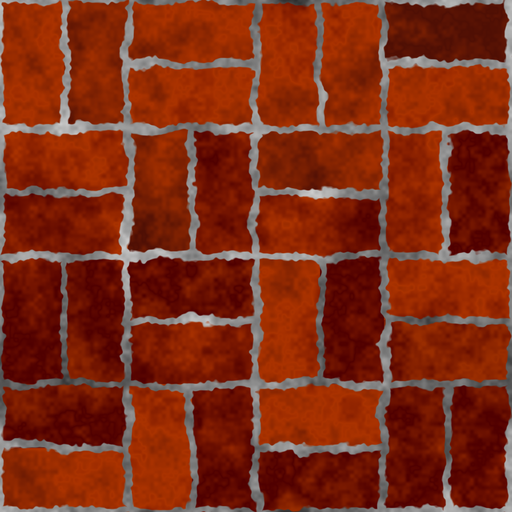
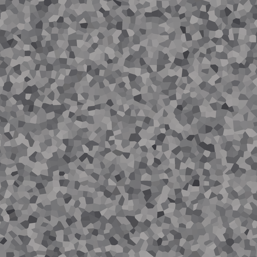
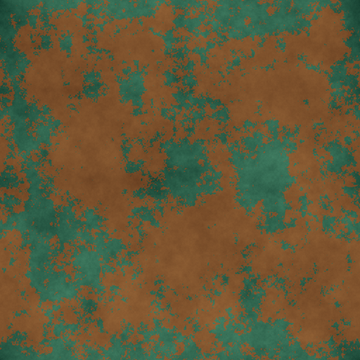
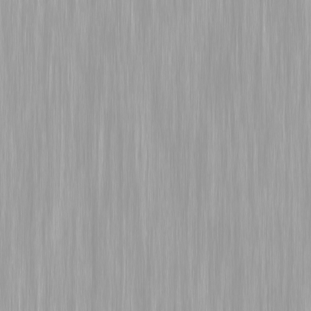
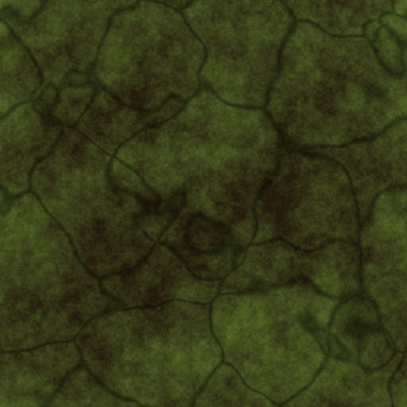
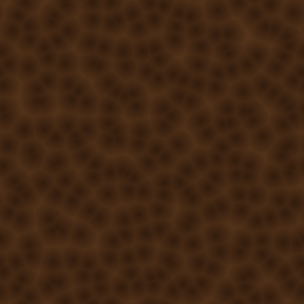

# Example materials

> ⚠️ Super-alpha, artist-built with AI help. These are "good enough to finish in
> the app" at best, not photoreal. See the main README warning.

Each `<name>/<name>.ptex` is a real graph this server authored from a one-line
prompt. Open any of them in Material Maker to inspect or edit the node network,
or render it headlessly (see the repo README). The `images/` previews are the
downscaled albedo maps; rendering a `.ptex` produces full-resolution albedo,
normal, roughness/metallic (ORM), and height maps.

| Preview | Material | Prompt | How it was built |
|---|---|---|---|
|  | Red brick wall | "red brick wall" | nearest bundled example, as-is |
|  | Polished gray granite | "polished gray granite" | fine voronoi per-cell-random flecks (port 2) through a multi-tone gray ramp |
|  | Weathered copper | "weathered copper" | two-layer recolor: copper base + green verdigris patina masked in |
|  | Brushed aluminum | "brushed aluminum" | straightened wood-grain clone: parallel directional streaks, forced metallic |
|  | Mossy forest floor | "mossy forest floor" | cracked-ground clone recolored soil-to-moss |
|  | Brown leather | "brown leather" | cellular grain recolored green-to-brown |

These come from the Phase 3 quality test set (`quality/`). The full 15-case
scorecard lives in `quality/scorecards/`.
